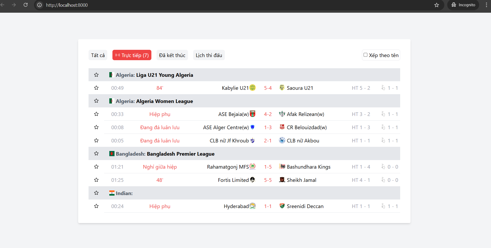
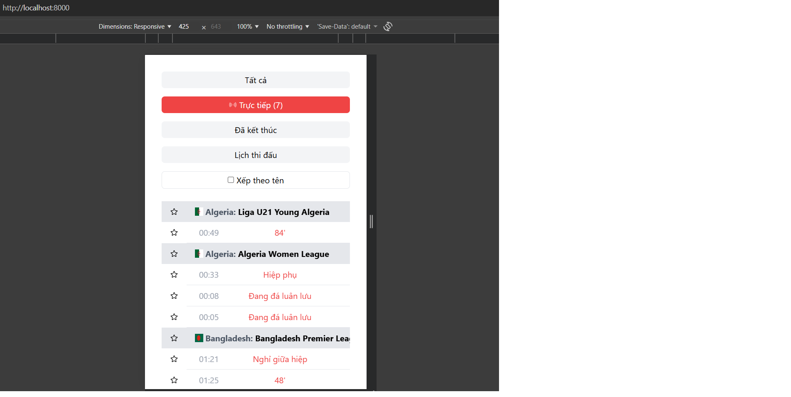
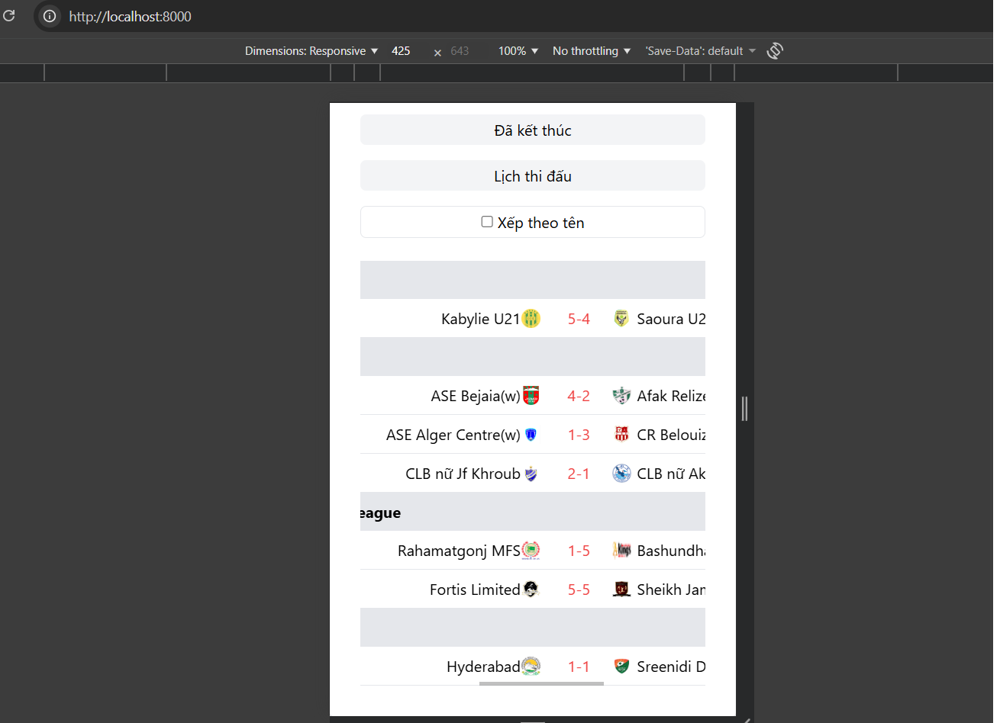

## Mô tả
Demo Sage theme

## STEP 1: KÉO DỰ ÁN TỪ GIT VỀ
- Clone dự án từ git: git clone https://github.com/TaiTran36/sage-theme.git sage-theme-wp
- Di chuyển vào folder dự án: cd sage-theme-wp
- Đổi sang nhánh develop: git checkout develop
## STEP 2: BUILD SOURCE:
1. Tại sage-theme-wp/:
- docker compose build
- docker composer up -d

2. Cài đặt thư viện
- Truy cập vào container wp: docker exec -it wp_sage bash
- Truy cập vào theme: cd wp-content/theme/sage-theme
- Cài composer: composer install
- Cài yarn: yarn install

3. Migrate dữ liệu
- wp acorn migrate --allow-root
- wp acorn db:seed --allow-root
4. Build style
- yarn build

5. Truy cập trên browser
- Truy cập: http://localhost:8000/
- Cài đặt thông tin WP
- Truy cập trang admin WP: http://localhost:8000/wp-login.php
- Vào chọn active Sage Theme: http://localhost:8000/wp-admin/themes.php
- Chuyển hướng sang màn hình bên ngoài: http://localhost:8000/

## Kết quả hiện tại
- Hiển thị trên PC: 
- Hiẻn thị trên mobile:
- 
- 

## Ghi chú thêm
- Hiển thị trên mobile đang để bảng các trận đấu dạng scroll ngang
